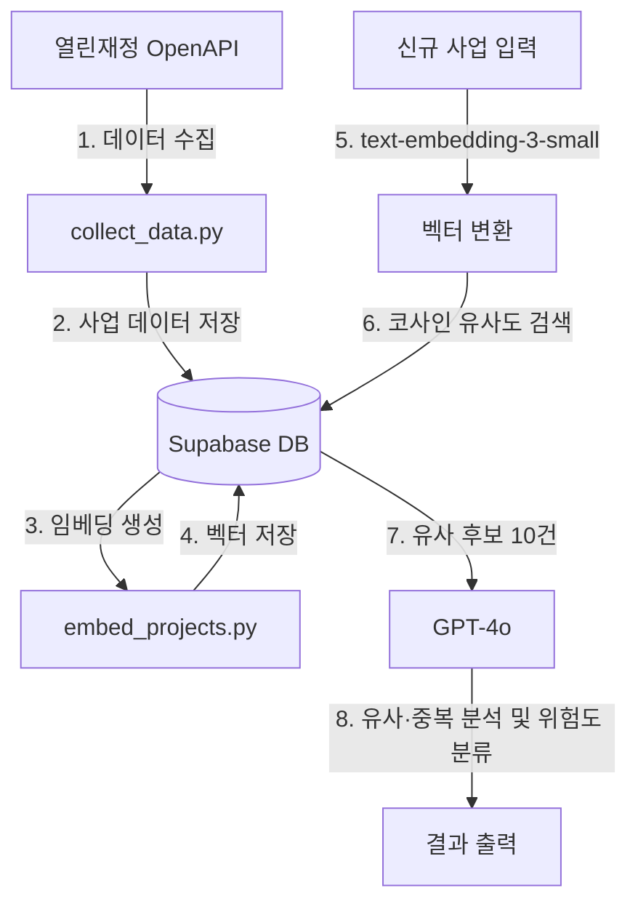

# 재정사업 유사·중복 탐지 시스템

### 1. 기획 배경 및 목표:
- 유사·중복 사업 과다 신청 및 부정 수급
    - 다수의 정부 부처 및 지자체에서 동일하거나 유사한 내용의 사업을 개별 발주하여 예산 낭비 초래
- 심사 과정에서의 검증 한계
    - 수천 건이 넘는 사업계획서를 수동으로 대조하는 전통적인 정성 평가 방식은 시간과 신뢰성 면에서 한계 존재

→ [목표]
AI 기반 자동 탐지로 유사·중복 사업을 사전에 검증하여 예산 낭비를 방지하고 담당자의 검토 업무 효율화

### 2. 기술 스택
- Python / Streamlit
- OpenAI (text-embedding-3-small, GPT-4o)
- Supabase (PostgreSQL + pgvector)

#### 데이터 수집 경로: [열린재정 OpenAPI](https://www.openfiscaldata.go.kr/op/ko/sd/UOPKOSDA01?odtId=76AU23AE21UGY07B863TV5243)

### 3. 다이어그램



### 4. 실행 방법
**uv 사용 시 (권장)**
```bash
uv sync
uv run streamlit run aiDetector.py
```

**pip 사용 시**
```bash
pip install -r requirements.txt
streamlit run aiDetector.py
```

### 5. 환경변수
`.env` 파일을 생성하고 아래 값을 입력하세요:

```
OPENAI_API_KEY=        # OpenAI API 키 (임베딩 및 GPT-4o 분석)
SUPABASE_URL=          # Supabase 프로젝트 URL
SUPABASE_ANON_KEY=     # Supabase 익명 접근 키
Openfiscal_api_key=    # 열린재정 OpenAPI 인증키
```

### 6. 데이터 파이프라인
1. collect_data.py - 열린재정 API 데이터 수집
2. embed_projects.py - OpenAI 임베딩 생성
3. aiDetector.py - 유사·중복 탐지 대시보드